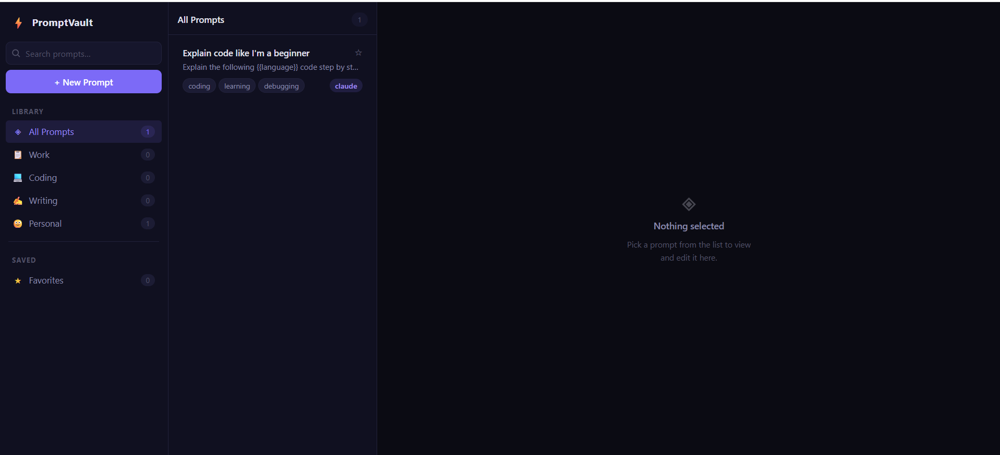

# ⚡ PromptVault

A prompt manager for people who use AI every day. Save, organise, and inject prompts directly into Claude and ChatGPT.

---

## Screenshot



---

## Why PromptVault

- You've rewritten the same "summarise this meeting" prompt forty times across forty different tabs.
- You had a perfect prompt once. You didn't save it. It's gone.
- You're constantly switching between your notes app, Claude, and ChatGPT just to copy-paste text you use every day.

PromptVault fixes all three.

---

## Features

- **Prompt library** — store as many prompts as you want, all in one place
- **Search and filter** — find any prompt instantly by title, content, or tag
- **Favorites** — star the prompts you reach for constantly
- **Category organisation** — keep work, coding, writing, and personal prompts separate
- **One-click inject** — send any prompt directly into Claude or ChatGPT without leaving the page
- **Template placeholders** — use `{{variable}}` syntax to mark the parts you'll fill in each time

---

## Installation

### Web App

```bash
git clone https://github.com/your-username/promptvault.git
cd promptvault
python -m http.server 8000
```

Open [http://localhost:8000](http://localhost:8000) in your browser.

### Chrome Extension

1. Go to `chrome://extensions` in Chrome
2. Enable **Developer mode** (toggle in the top right)
3. Click **Load unpacked** and select the `extension/` folder
4. Visit [http://localhost:8000](http://localhost:8000) once — the extension syncs your prompts automatically on every visit

The extension icon will appear in your toolbar. Click it on any Claude or ChatGPT tab to inject prompts.

---

## How to Use

1. **Add a prompt** — click **+ New Prompt**, give it a title, paste your prompt, pick a category and model, save.
2. **Find it later** — use the search bar or click a category in the sidebar. Star anything you use daily.
3. **Use template variables** — write `{{topic}}` or `{{code}}` anywhere in a prompt. When you inject it, just fill in the blanks.
4. **Inject into Claude or ChatGPT** — open the extension popup, click any prompt, and it lands directly in the input box. Hit send.

---

## Roadmap

- [ ] Firebase sync — access your prompts from any device
- [ ] Team sharing — share prompt libraries with your team
- [ ] More platforms — Gemini, Mistral, Perplexity, and others

---

## Built With

- **Vanilla JS** — no framework, no build step, just files
- **HTML & CSS** — CSS Grid, CSS variables, dark theme out of the box
- **Chrome Extensions API** — Manifest V3, `chrome.storage.local`, content scripts
